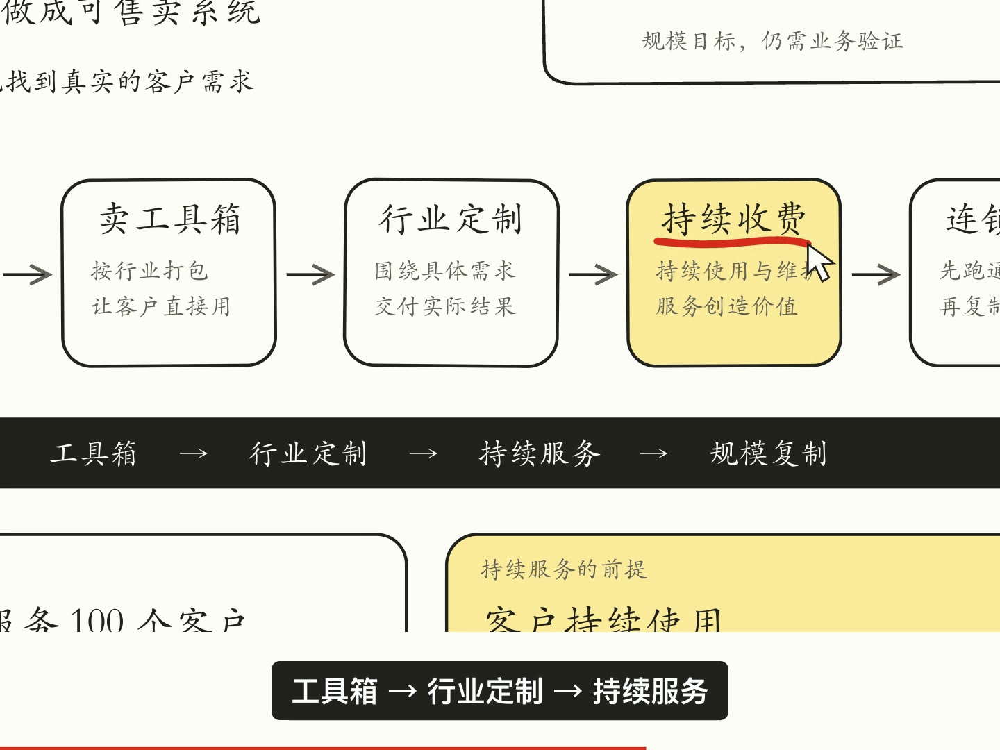

# Video Skills

用于制作可编辑讲解视频的 Agent Skills。首个技能 **infographic-explainer** 复现「一张信息图 + 局部聚焦 + 临时红笔划线 + 旁白字幕」的效果。



[查看 26 秒样片](examples/infographic-explainer-26s.mp4) · [技能说明](skills/infographic-explainer/SKILL.md)

## 安装给对方使用

下载本仓库 ZIP，解压后把 `skills/infographic-explainer` 整个目录复制到对应助手的技能目录。不能只复制 `SKILL.md`，模板和脚本也需要保留。

- Codex：`~/.codex/skills/infographic-explainer/`
- Claude Code：`~/.claude/skills/infographic-explainer/`
- 其他支持 SKILL.md 的助手：按该工具的技能目录规则安装；未支持时可让助手读取本仓库中的 SKILL.md。

目标目录已存在时先比较版本，避免覆盖个人修改。重新启动助手会话使其发现新技能。GitHub 下载 ZIP 位于仓库的 Code 菜单。

然后在 Codex 中输入：

```text
使用 $infographic-explainer，把下面的内容做成 26 秒中文讲解视频：
[我的主题与要点]
要求：白底手绘信息图，淡黄色重点卡片，镜头跟着讲解聚焦，
每次只出现一条红线，停留后消失，带中文旁白和底部字幕。
输出 MP4 和可编辑项目。
```

安装技能不等于安装渲染环境。对方需要 Node.js 22+、pnpm、FFmpeg，以及 HyperFrames 可启动的 Chromium 环境。初次安装依赖/浏览器需要网络。仓库不要求任何 API 密钥；新主题的在线配音或生图取决于对方可用的工具。

## 不通过助手，直接运行样例

在仓库目录执行：

```sh
node skills/infographic-explainer/scripts/init-project.mjs ../my-explainer
cd ../my-explainer
pnpm install
pnpm check
pnpm render --output renders/final.mp4 --quality high --workers 2
```

使用新目录；初始化不会覆盖已有项目。

编辑 `index.html.in` 替换底图内容，编辑 `story.json` 调整镜头、单条批注、字幕和旁白。具体字段见[项目指南](skills/infographic-explainer/references/project-guide.md)。

## 已实现与边界

- 一张连续 SVG 画布，按讲解段落缩放和平移。
- 红线逐渐画出，指针跟随；上一条消失后才出现下一条。
- 固定字幕区域；按音频时间安排动画。
- 构建时拒绝批注、字幕、镜头运动或旁白时间重叠。
- 附带现成中文音频，可直接渲染样例。样例声音来自 macOS Tingting，语速 255；生成新旁白不限定此声音。
- 当前是助手规划 + 配置驱动的流程，不是任意图片/音频的一键自动识别系统。
- 底图是 SVG，没有使用 ImageGen；支持按用户需求换成生成图片或已有图片。
- 字体未打包。不同机器需要核对字体和排版；Windows/Linux 的默认回退字体不保证与 Mac 样片完全一致。

样例中的商业内容只是视觉演示素材。技能会根据用户的新主题替换底图和旁白。

## 依赖

模板固定使用 HyperFrames 0.8.30 和 GSAP 3.14.2，由 pnpm 安装；本仓库不内嵌第三方库或系统字体。第三方依赖和工具适用各自的许可条款。

本仓库的技能说明和自有代码采用 [MIT License](LICENSE)，允许复制、修改和分发。第三方依赖和字体不因此改变许可。

验证环境：Mac M1 Pro。已从独立新目录完成安装、构建、HyperFrames 全项检查及 26 秒含音轨 MP4 渲染，并抽帧确认临时批注效果。Windows/Linux 未做实机验证。
